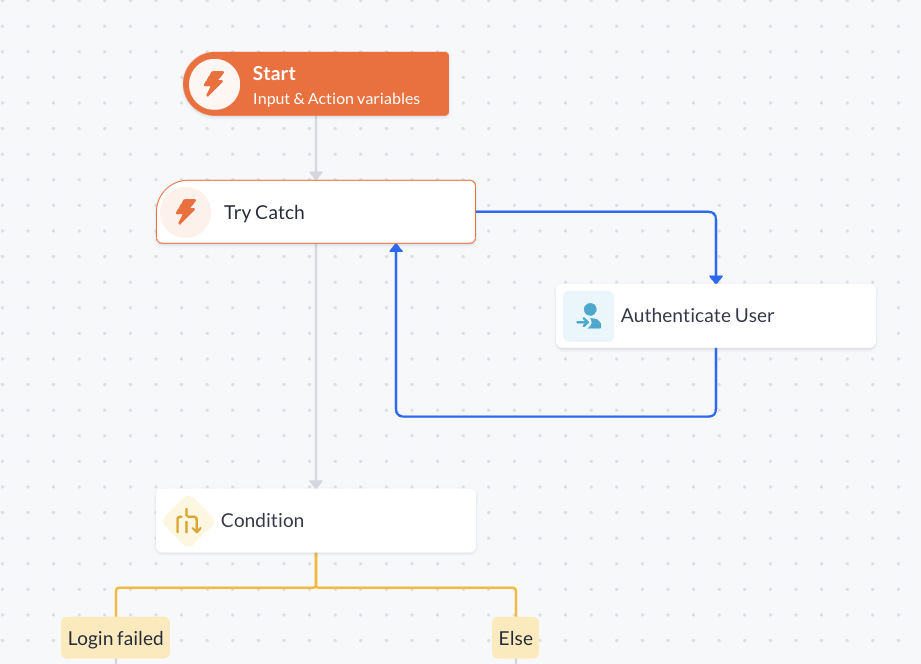
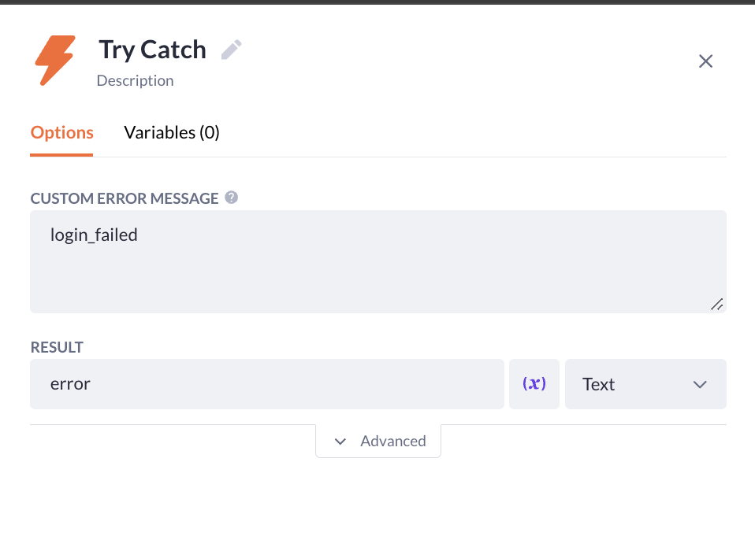

# Try Catch - Action step

The try...catch statement marks a block of steps to try, and specifies a response, should an exception be thrown.

## Options

### Custom Error Message

You can define a custom error message. This custom message will be returned when any of the steps failed. You can use this custom message in conditions to compare states.

### Result

The name of the variable in which to store the error message.
